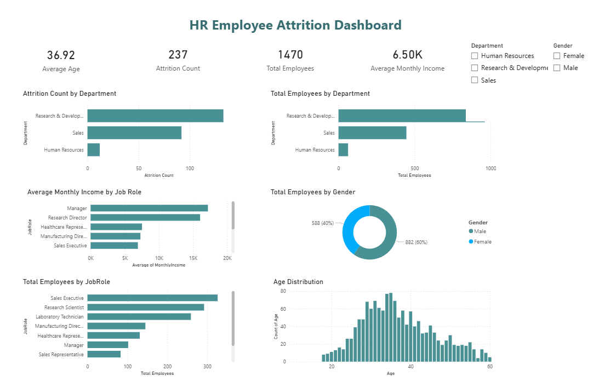

# HR Employee Attrition Dashboard

## Overview
This project is an interactive HR analytics dashboard built using Power BI. It provides insights into employee attrition, workforce demographics, department distribution, job roles, and salary trends.

## Dashboard Preview

## Features
- Employee Attrition Analysis
- Total Employees Overview
- Average Monthly Income
- Average Employee Age
- Department-wise Employee Distribution
- Gender Distribution
- Job Role Analysis
- Age Distribution

## Tools Used
- Power BI
- DAX
- HR Analytics Dataset

## Files
- HR Analytics Dashboard.pbix
- HR.png
